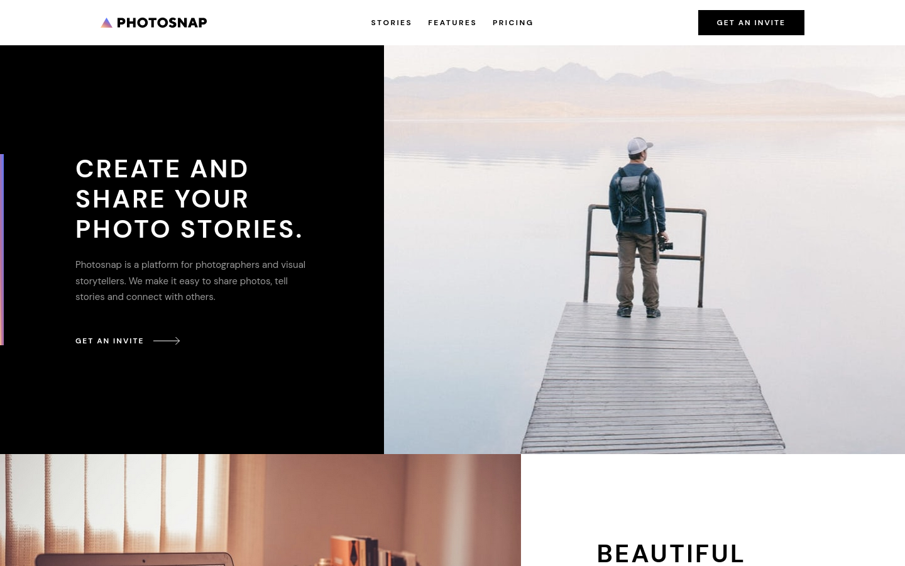

# Photosnap Website - A Frontend mentor Challenge

Live Site URL: https://photosnap-mentor.netlify.app/

### Built with

- Mobile-first workflow
- Semantic HTML5 markup
- Flexbox/Grid layouts
- Vanilla JavaScript
- Sass
- CSS3 transitions

### Layout

The layout is implemented from a Figma design with the following screen sizes:
- Mobile 375 x 667
- Tablet 768 x 1024
- Desktop 1440 x 900

What happens between those screen sizes is something entirely made up by me.

### The challenge

Users should be able to:

- View the optimal layout for each page depending on their device's screen size
- See hover states for all interactive elements throughout the site

[Frontend mentor challenge](https://www.frontendmentor.io/challenges/photosnap-multipage-website-nMDSrNmNW). Frontend Mentor challenges help you improve your coding skills by building realistic projects. 

### Screenshot

## Author

- Frontend Mentor - [hebrerillo](https://www.frontendmentor.io/profile/hebrerillo)

